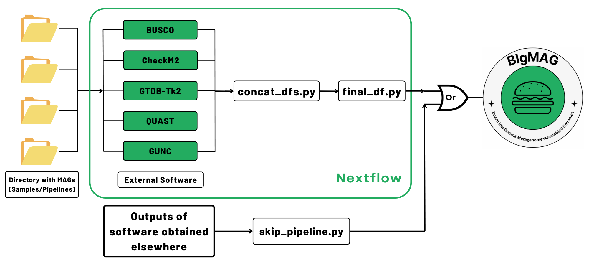

# MAGFlow

<p align="center">
    
</p>

MAGFlow serves as pipeline to generate the input file for [BIgMAG](https://github.com/jeffe107/BIgMAG) by measuring the quality of metagenomes through multiples tools and annotating them taxonomically.

[](https://www.nextflow.io/)
[](https://docs.conda.io/en/latest/)
[](https://www.docker.com/)
[](https://sylabs.io/docs/)
[](https://github.com/jeffe107/MAGFlow/actions/workflows/linting.yml)
[](https://github.com/jeffe107/MAGFlow/blob/main/tests/nf-test_output.txt)
[](https://doi.org/10.5281/zenodo.11178032)
[](https://cloud.seqera.io/launch?pipeline=https://github.com/jeffe107/magflow)


## Installation

The pipeline runs under Nextflow DSL2; you can check how to install Nextflow [here](https://www.nextflow.io/docs/latest/install.html). Please notice that you need to have Java JDK (recommended version 17.0.3) available to be able to install Nextflow. 

To install MAGFlow, you just need to clone this repository:
```bash
 git clone https://github.com/jeffe107/MAGFlow.git 
```

## Pipeline summary

MAGFlow receives folders containing bins or MAGs in any decompressed (.fna, .fa, .fasta) or compressed (.gz) format, and it is able to detect empty bins to prevent the analysis failing (they are kept inside the output directory if you want to check them). The files should be input following this structure:
```bash
.
└── samples/
    ├── sample1/
    │   ├── bin1
    │   ├── bin2
    │   └── ...
    ├── sample2/
    │   ├── bin1
    │   ├── bin2
    │   ├── bin3
    │   └── ... 
    └── ...
```
In addition, you can provide a .csv file with the names of the samples and the paths:

| sampleId      | files            |
| ------------- | ---------------- |
| sample1       | path/to/sample1  |
| sample2       | path/to/sample2  |
| ...           | ...              |

Please check in the *Pipeline Usage* section to see how to input one or another.
> [!WARNING]
> Please make sure that all of the bins in the same folder have the same extension. Bins belonging to different samples can have different extensions.

<p align="center">
    
</p>

- examines completeness and contamination with [CheckM2](https://github.com/chklovski/CheckM2) v1.0.1 and [BUSCO](https://busco.ezlab.org/busco_userguide.html) v5.7.0.
- determines different metrics and statistics using [QUAST](https://quast.sourceforge.net/) v5.2.0.
- detects chimerism and contamination by running [GUNC](https://github.com/grp-bork/gunc) v1.0.6.
- optionally assigns taxonomy to bins using [GTDB-Tk2](https://ecogenomics.github.io/GTDBTk/index.html) v2.4.0.

Finally, a file named *final_df.tsv* will be generated, and it can be used to display the dashboard using [BIgMAG](https://github.com/jeffe107/BIgMAG).

## Pipeline Usage
The basic usage of the pipeline can be achieved by running: 

If you want to test the proper behaviour of the pipeline you can just run:
```bash
 nextflow run MAGFlow/main.nf -profile test,<docker/singularity/podman/shifter/charliecloud/apptainer/conda/mamba> --outdir <OUTDIR>
```
To run the pipeline with the default workflow:
```bash
 nextflow run MAGFlow/main.nf -profile <docker/singularity/podman/shifter/charliecloud/conda/mamba> --files 'path/to/the/samples/*' --outdir <OUTDIR>
```
In case you wish to input a csv file with the details of your samples, you can replace the flag `--files` for `--csv_file 'path/to/your/csv_file'`.
### Databases
Running MAGFlow  in its default state will attempt to download automaically CheckM2 (~3.5 GB) and GUNC (~12 GB) databases in your specified output directory. Please make sure you have enough space to store these databases. Moreover, if you have customized or different versions you would like to use, you can use these flags to include them `--gunc_db '/path/to/your/gunc_db.dmnd'` and `--checkm2_db '/path/to/your/checkm2_db.dmnd'`.

In the case of the database required by GTDB-Tk2, MAGFlow does not download by default given its large required storage (~85 GB); however, if you can include the flag `--run_gtdbtk2` to both automatically download the database and run the analysis. Likewise, you can run GTDB-Tk2 by using your own version of the database with `--gtdbtk2_db '/pathto/to/your/gtdbtk/release*'`
> [!WARNING]
> Notice that when you *untar* any GTDB dabatase, it is stored under the name `release*`; please keep the word *release* in the name to guarantee a proper detection by the pipeline.

As mentioned before, the databases downloaded by the pipeline are stored in your output directory inside a folder named `databases`, you may want to keep them for further runs of the pipeline and include them with the previously provided flags, speeding up the process.

### Profiles
The pipeline can use different techonologies to run the required software. The available profiles are (select them considering your system configuration):
- docker
- singularity
- podman 
- shifter 
- charliecloud
- conda
- mamba
- apptainer

Natively, the pipeline will pull containers from [quay.io](https://quay.io/). In the case of singularity and apptainer profiles, the pipeline will pull containers from [Galaxy project](https://depot.galaxyproject.org/singularity/).

Furthermore, if the execution of the pipeline fails while using profiles that require to mount directories, i.e. apptainer, throwing an error related with problems to find any file you can attempt to solve this by including the flag `--directory_to_bind 'path/to/the/directory'`.

On the other hand, when using mamba or conda as profiles, you may want to make sure you have only bioconda, conda-forge and defaults as available channels, in that order.

### Executors
In its default state, the pipeline will use the local executor to perform the requested tasks, this means that it will only attempt to use the available resources at the moment of launching the job. Nonetheless, if you wish to take advantage from other executors such as slurm, sge, bridge or cloud-based infrastructure such as AWS or Azure Batch, you can include especific profiles to achieve this task (check the Nextflow documentation for [this](https://www.nextflow.io/docs/latest/executor.html#)). For instance, to allow slurm execution, you can modify the configuration of the general file by creating your own customized profile (uncommenting the line): 

https://github.com/jeffe107/MAGFlow/blob/244f2d9a783ff0ee4dc6971d376d2ad90be91cb8/nextflow.config#L50

Also, the pipeline, following nf-core directions, is able to the check maximum resources can be requested in each system to allocate them to every job. You may want to check the file `conf/base.config` to change the resources provided to each process.

### Software parameters

#### BUSCO

By default BUSCO is going to use bacteria_odb10 lineage to search for SCO in the input bins. If you wish, to use a different lineage you can use the flag `--lineage 'your_preferred_lineage'` or even `--lineage 'auto_lineage'` to allow BUSCO automatically detecting the correct lineage (if your samples are too diverse, the *auto_lineage* strategy may fail). To append additional BUSCO parameters, please use the flag `--busco_options '--any_flag to_run_busco'`.

#### CheckM2, GTDB-Tk2 and GUNC

As for BUSCO, you can append additional parameters to these tools by:
- `--checkm2_options '--any_flag to_run_checkm2'`
- `--gtdbtk2_options '--any_flag to_run_gtdbtk2'`
- `--gunc2_options '--any_flag to_run_gunc'`
> [!WARNING]
> Please check the documentation of these tools before including any additional parameter.

#### QUAST
To analyze the bins using QUAST, there are two parameters set that you can modify at your convenience. The max-ref-number is set to 0 to prevent QUAST to try to download reference genomes from SILVA 16S rRNA database, and align against them aftewards. If you want to enable this feature, you can add the flag `--max_ref_number <N>` (N: number between 1 and 50). Please notice that this feature sometimes may fail depending on your system configuration. Moreover, you can modify the minimun contig length detection by including  `--min_contig <N>` in your command (the default value is 150).

### Output directory

In your especified output directory, you will find folders named accordingly to your input files, and inside these the output from each of the tools executed along with a folder containing the empty bins if found. In addition, you will see the afore-mentioned directory containing the databases, if downloaded by MAGFlow. Inside a directory called *pipeline_info*, you will find the execution reports generated by Nextflow. Ultimately, you will see the file *final_df.tsv*, which is the main input to display the dashboard.

### Skip the pipeline

If you have previously generated BUSCO, CheckM2, GTDB-Tk2, GUNC or QUAST files and you wish to use them to display the dashboard using [BIgMAG](https://github.com/jeffe107/BIgMAG), we have developed the script `skip_pipeline.py`, which is able to concatenate the files into the required *final_df.tsv* by [BIgMAG](https://github.com/jeffe107/BIgMAG). You can run the following command:

```bash
 MAGFlow/skip_pipeline.py example.csv path/to/store/the/file 
```
Please notice that you will need to provide a *csv* file indicating the sample/pipeline names and the paths to the different files. You can use the following template:

| sampleId      | busco_path       | checkm2_path  | gunc_path       | gtdbtk2_bac_path | gtdbtk2_ar_path  | quast_path    | 
| ------------- | ---------------- | ------------- | --------------- | ---------------- | ---------------- | ------------- |
| sample1       | path/to/file     | path/to/file  | path/to/file    | path/to/file     | path/to/file     | path/to/file  |
| sample2       | path/to/file     | path/to/file  | path/to/file    | path/to/file     | path/to/file     | path/to/file  |
| ...           | ...              | ...           | ...             | ...              | ...              | ...           |

> [!WARNING]
> It is not necessary to account with output files from all the tools for allowing [BIgMAG](https://github.com/jeffe107/BIgMAG) to display the results. Nonetheless, if you provide, for example, CheckM2 output files, these must be present for all of the specified samples, otherwise [BIgMAG](https://github.com/jeffe107/BIgMAG) will fail to render the plots properly.

In addition, the `skip_pipeline.py` script uses the following convention column names to search for the names of the bins in each file. Please make sure that your output files from the specified tools have the following column names (upper and lowercase apply):
```
BUSCO files     → 'Input_file'
CheckM2 files   → 'Name'
GTDB-Tk2 files  → 'user_genome'
GUNC files      → 'genome'
QUAST files     → 'Assembly'
```

## Acknowledgments
Tool developed under the support of the *Federal Commission for Scholarships for Foreign Students* (FCS) through the program *Swiss Government Excellence Scholarships*.

## Citation
If you find BIgMAG/MAGFlow useful, please cite our paper or share this tool through platforms such as X and LinkedIn:

> **Metagenome quality metrics and taxonomical annotation visualization through the integration of MAGFlow and BIgMAG.**
>
> Yepes-García J and Falquet L.
>
> _F1000Research_ 2024, 13:640. doi: [10.12688/f1000research.152290.1](https://doi.org/10.12688/f1000research.152290.1).

An extensive list of references for the tools used by the pipeline can be found in the [`CITATIONS.md`](CITATIONS.md) file.

This pipeline uses code and infrastructure developed and maintained by the [nf-core](https://nf-co.re) community, reused here under the [MIT license](https://github.com/nf-core/tools/blob/master/LICENSE).

> **The nf-core framework for community-curated bioinformatics pipelines.**
>
> Philip Ewels, Alexander Peltzer, Sven Fillinger, Harshil Patel, Johannes Alneberg, Andreas Wilm, Maxime Ulysse Garcia, Paolo Di Tommaso & Sven Nahnsen.
>
> _Nat Biotechnol._ 2020 Feb 13. doi: [10.1038/s41587-020-0439-x](https://dx.doi.org/10.1038/s41587-020-0439-x).
